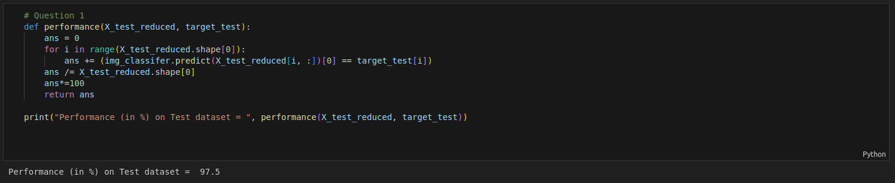
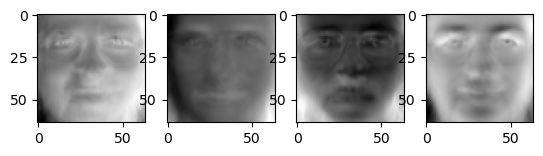

## Question 1
For face vectors recognition with extracting the eigenvectors that capture 90% of the variance, we get the following accuracy on the test dataset:
**Test Accuracy =** 97.5%

## Question 2

### a) 80% variance
For face vectors recognition with extracting the eigenvectors that capture 80% of the variance:

X_train.shape=(360, 4096)
X_test.shape=(40, 4096)

X_train_reduced.shape = (360, 26)
X_test_reduced.shape = (40, 26)

**A reduction from 4096 to 26 in the dimension.**

Corresponding Eigenfaces:

